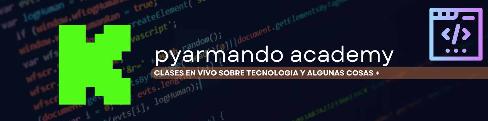

# 🚀 Backend Master – Curso en vivo por Kick




---

## 📌 Descripción

Este repositorio contiene todo el código y materiales del **curso de Programación Backend** impartido en vivo en **[Kick](https://kick.com/pyarmandoacademy)**.  
Aprenderás desde los fundamentos hasta proyectos avanzados, con ejemplos reales y buenas prácticas.

---

## 📺 Clases en vivo

🎥 **Transmisiones diarias**  
- 🕙 **Frontend** → 10:00 AM  
- 🕓 **Backend** → 4:00 PM  
- 🕘 **Base de datos** → 9:00 PM  

📍 **Enlace de transmisión** → [Ver en Kick](https://kick.com/pyarmandoacademy)  
📂 **Clases anteriores** → [Ver grabaciones](https://kick.com/pyarmandoacademy/videos)

---

## ✨ Contenido del curso

- 🔹 Logica de Programacion
- 🔹 Tipo de Datos
- 🔹 Procesos Condicionales
- 🔹 Bucles - Tipos 
- 🔹 Manejo de Colecciones
- 🔹 Trabajando con Archivos
- 🔹 Instalacion de Librerias en Entornos Virtuales

---


## ⚙️ Instalación y uso

```bash
# 1. Clonar el repositorio
git clone https://github.com/PyarmandoCode/BackEnd_Kick

```
## 📚 Videos de Repaso

### 1️⃣ Instalación de Python

  <a href="https://youtu.be/Ij89scb630s">
    
  </a>

### 2️⃣ Tipo de datos


  <a href="https://youtu.be/u3wqtptNOx8">
    
  </a>

### 3️⃣ Primeros Pasos en Python

  <a href="https://youtu.be/LUYJ6d1CA38">
    
  </a>  

### 4️⃣ Como Utilizar Prompt en python

  <a href="https://youtu.be/Jbhk2W_eDIE">
    
  </a>   


### 5️⃣ Como Utilizar Condicionales

  <a href="https://youtu.be/HcuDLoEEers">
    
  </a> 

### 6️⃣ Operadores Ternarios

  <a href="https://youtu.be/G-70bsoEXMk">
    
  </a>

